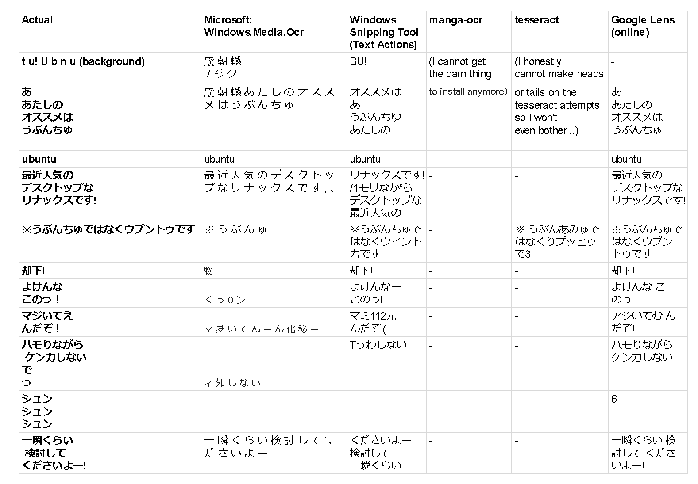

# lenzu

Desktop lens (almost like desktop magnifier commonly found in accessibility application for the visually impaired users) which detects images (initially started as OCR) to real-time analyze (possibly via OpenCV) the small window where the mouse cursor hovers (for example, for OCR, it can then add furigana to all the kanji via kakasi or analyze for phonetics via mecab for possibly screen-reading).

## Libraries

Target platforms are Linux (Debian) and Windows (MinGW64).  Not really relevant to list it here since all you need to do is look at my Cargo.toml but just in case:

- kakasi (I believe rust version is self-contained, so no need to install executable version)
- tesseract (rusty-tesseract expects tesseract-ocr executable and it's trained-data pre-installed)
- leptonica (the MinGW pacman version statically links leptonica it seems, so you won't find MinGW libs for this one, you'll have to hand-compile using MinGW gcc)
- windows-rs (features: Media_Ocr, Globalization) - also want to make sure to install (in Windows Settings) for Japanese language
- winit

## Tesseract versus Windows OCR

Firstly, I want to emphasize that performance means nothing, if accuracies is just crap...  With that said, currently for offline OCR, I've tried

- [Tesseract](https://github.com/tesseract-ocr/tesseract)
- [Windows Media.OCR](https://learn.microsoft.com/en-us/uwp/api/windows.media.ocr)
- [Manga-OCR](https://github.com/kha-white/manga-ocr) (Note that his work `mokuro` which integrates manga-ocr is just superior!)

Note that though I've installed EasyOCR, but it turns out it does NOT handle vertical Japanese, hence it's not even part of the considerations.  I've also tried to run [gazou](https://github.com/kamui-fin/gazou) but if you look in the "Dependencies" section, it clearly states it requires tesseract (and leptonica), so I've skipped on that.  Incidentally, installing leptonica (even via MinGW) is just painfully time-consuming on Windows (it's really a breeze on Linux).

With that said, I've found that Manga-OCR is the most accurate, but the problem it turns out, is that the folks who publishes the [Manga109s dataset](http://www.manga109.org/ja/index.html) are not too responsive and never got back to me, so I have to toss this out of my toolbox as well.

    NOTE: As of 2024-03-05 (password expired in 5 days), I've finally got a response from them, and have acquired UID+password to download the data (3.1GB) they've used for training.  Hence I may attempt to retrain "jpn_vert" for tesseract-traineddata using their batch in the future (if/when I have time).

So I'm now left with tesseract and Windows Media.Ocr...  First, the test I've used is the CC licensed manga [Ubunchu!](http://www.aerialline.com/comics/ubunchu/):


Here's the text converted result for Microsoft.Media.Ocr:

    ```text
    $ time cargo run --bin sample_ocr media/ubunchu01_02.png
        Finished dev [unoptimized + debuginfo] target(s) in 0.55s
        Running `target\debug\sample_ocr.exe media/ubunchu01_02.png`
    Windows: Evaluating '"media/ubunchu01_02.png"' for forward-slashes
    驫 朝 轗 あ た し の オ ス ス メ は う ぶ ん ち ゅ / 衫 ク 最 近 人 気 の デ ス ク ト ッ プ な リ ナ ッ ク ス で す , 、 ubuntu ※ う ぶ ん ゅ く っ 0 ン 物 ィ 夘 し な い マ 夛 い て ん ー ん 化 秘 ー 一 瞬 く ら い 検 討 し て ′ 、 だ さ い よ ー

    real    0m1.856s  <--- ~2 seconds
    user    0m0.000s
    sys     0m0.000s
    ```

Note: See comments below in regards to "くださいよー!" being correct on one pattern but incorrect (above/here) for this usage.

And the following is for tesseract:

    ```text
    $ time tesseract.exe media/ubunchu01_02.png stdout -l jpn+jpn_vert+osd --psm 6
    =    N    2    。 465
    、 いい       必メ - の        い
    スッの          7  <        ち
    すな \ン。
    -   2_/   AN ubuntu
    NOか
    N       と\        王i       @
    ※ うぶんあみゅではなくりプッヒゥで3          |
    て      \ 一  ーー レブ ーベデーー ー ェー
    ミミの
    ee
    上 っ    ツア王SN 2にンンジSS
    だ討瞬    を(タジン| の
    シンニーテデい
    | にあこ
        レイ人 ーー シク

    real    0m33.681s   <- ~34 sec
    user    0m0.032s
    sys     0m0.000s
    ```

And with manga-ocr via mokuro:

    ```text
    # time mokuro  --disable_confirmation=True /tmp/mangadir/ ; ls -lAh
    Paths to process:
    C:\msys64\tmp\mangadir
    2024-03-06 16:19:49.269 | INFO     | mokuro.run:run:48 - Processing 1/1: C:\msys64\tmp\mangadir
    Processing pages...: 100%|███████████████████ ... ███████████████| 1/1 [00:00<00:00, 10.03it/s]
    2024-03-06 16:19:49.433 | INFO     | mokuro.run:run:56 - Processed successfully: 1/1

    real    0m32.217s   <--- ~32 sec (but "processing pages" itself only took like 300 mSec!)
    user    0m0.000s
    sys     0m0.000s
    total 296K
    ```

I had to use mokuro because manga-ocr kept on crashing...  But the "Processing pages" part looks like only took ~300 mSec...  mokuro does extra stuffs like generate html with text position where you can hover over the text to get the text from.  But it's a great app (it was hell compiling it though because the pip version did not work)

Overall, I think manga-ocr is probably the most ideal candidate IF it works, but it's just too finiky and I think I spent more time trying to install it more than code/test it.

As for tesseract, I've tried ALL PSM settings, and PSM==5 was the closest it go to some recognition, hence I really wanted to get a hold of that manga109s data to train tesseract, but they're not responding, so I've given up.

Lastly, the most attractive (ease of library usage, documentations, free/access, accuracies, performance, dependabilities, linking against libs, etc) Microsoft.Media.Ocr is just the most ideal choice!  I cannot stop praising  Microsoft!  But unfortunately, this library restricts to just Windows.

Somebody on reddit mentioned that Apple also has descent accuracies but you'd have to download the language seprately and it is proprietary;  These are commonly due to the commercial operating system companies wanting to make sure the target country has language support.  For Windows for example, if you want Japanese support in which your installation was from non-Japanese installer version, you will have to have the desktop settings system download the Japanese language supprts from Microsoft (see for example [TryCreateFromUserProfileLanguages()](https://learn.microsoft.com/en-us/uwp/api/windows.media.ocr.ocrengine.trycreatefromuserprofilelanguages) method) in which if the target [Language](https://learn.microsoft.com/en-us/uwp/api/windows.globalization.language) is not installed, it will not be able to OCR successfully.  And as mentioned, unfortunately, it is propritary to the operating systems.  And in general, these are somewhat tied mainly IMHO (this is just an opinion) because it needs to support accessibilities for screen-readers (TTS) for vision-impared.

I'm sure Linux Desktop has TTS accessibilities which does screen-reader, but I've never been able to successfully get [mecab](https://taku910.github.io/mecab/) or Orca (yes, I like Gnome) to work well in harmony.  There are some excellent web-based TTS which even will flavor the voice according to your choices, but that's actually non-OCR topic, mainly because these are post-OCR-processed applications (they expect actual TEXT, after image has been optically recognized and converted to text).  And lastly (on this topic outside OCD) most screen-readers for vision-impared do NOT OCR (read images), they usally only read texts (UTF-8, JIS, etc), which is a different topic (see mecab, and other libraries which will analyze neighboring texts and determine how to pronounce it (phonetically) - for my purpose, I use [kakasi](http://kakasi.namazu.org/index.html.ja) which does neighbor analysis based on dictionary/jisho (basically, jisho already have "words" of 2 or more sequential kanji in pronounciation via hiragana); but enough on non-OCR topic...

In the end, for now, I've given up on other platforms and concentrating strictly on Windows using Microsoft's Windows.Microsoft.Media.Ocr library, since I just want offline OCR (that's the key, "offline OCR").

Side note: I don't know how they do it, but the new "Snipping Tool" available on Windows 10/11 has this feature called "Text Action" in which I presume is using the same library, but for some reason, it takes longer time (I think it took like 7 seconds) and here's the result:

    ```text
    リナックスです!
    /1モリなか”ら
    デスクトップな
    最近人気の
    オススメは
    BU!
    ※うぶんちゅではなくウイントカです
    あ
    うぶんちゆ
    あたしの
    ubuntu
    却下!
    Tっわしない
    マミ112元
    んだぞ!(
    よけんなー
    このっl
    くださいよー!
    検討して
    一瞬くらい
    ```

Unfortunately, the tool has no interface/options to instruct that it should OCR from top-to-bottom+right-to-left so the order of the text becomes left-to-right (backwards) even though it figures out it is vertical text (top-to-bottom).  In any case, it's not a OCR application, but has the capabilities and I'm sure it's using the same library.

But what I wanted to point out is (though I'm still convinced they both use the same library) the hiragana 'く' on this one (the last phrase "くださいよー!") is correct, as compared to the direct usage of the windows.Media.Ocr library, the 'く' turns into '′ ' (upper part of 'く') and '、' (lower part of 'く') which looks like hiragana 'く'.

Some claim that on certain usages of OCR, the `゛` (as in `ぶ`) and `゜` (as in `ぷ`) sometimes gets smeared on low-quality images and cannot be read.  There are 2 kinds of [Google Lens](https://lens.google.com/), the web interface version and Android Application version.  At least on Android Application version, probably because the camera will force it to capture at high resolution, I've never seen this phenomenom occur.

Incidentally, the web-version of Google Lens OCR'd as:

    ```text
    最近人気の
    デスクトップな
    リナックスです!
    あ
    あたしの
    オススメは
    うぶんちゅ
    ubuntu
    ※うぶんちゅではなくウブントゥです
    却下!
    6
    ハモりながら ケンカしない
    アジいてむ んだぞ!
    一瞬くらい 検討して くださいよー!
    よけんな このっ
    ```

Although Google Lens scans from left to right, it still understands Japanese to be top-to-bottom-right-to-left, and you have to agree, it's THE MOST ACCURATE!  Kudos to [Google Cloud Vision](https://cloud.google.com/vision/docs/ocr) (at least, I want to belive it's using THIS API);  Overall, if you can go through [OAuth2](https://developers.google.com/identity/protocols/oauth2) and use online OCR, I highly recommend relying on Google Cloud Vision!  As for me, I need this application to be usable offline, hence I am going with Microsoft.

In the future, I may give it an option (via command line arg) to choose between offline (Microsoft) and online (Google Cloud Vision via OAuth2) - if you search my other github (Rust) projects, I have an OAuth2 + Google Cloud Vision somewhere...

### Comparision

Just a quick comparison compilation:



### windows-rs

For windows.Media.Ocr integrations with rust, you'll need to at least enable 2 features `Media_Ocr` and `Globalization`.  You can click on the [Feature Search](https://microsoft.github.io/windows-rs/features/) link in the [crates.io](https://crates.io/crates/windows) page to search for what other features you'd need:

    ```bash
    $ cargo add windows-rs --features Media_Ocr,Globalization,Storage_Streams
    ```

## Other Thoughts

All in all, I prefer things to be usable offline (mainly for performance) as long as it works 80% of the time.  If (in the future) if a translator feature was needed, for offline mode, ideally all one has to do is use the jisho library such as jdict used by kakasi to lookup (or any other Japanese-to-<your_language> dictionary) and be done (do minimal).

On the other hand, if going online, it would probably be nice to also have features such as OpenAI, ChatGPT, and (of course) Google Translate to auto-translate for you (which requires either an API key or OAuth2).

Going online also means few things:

- Pro: The major pro, is that with Google Cloud or Microsoft Azure (Microsoft has larger language support than Google) you get high-accuracy image recognition and confidence.  
- Con: The con is you most likely will have to pay some money for using the service if you go over the daily quota/limit/cap.
- Pro (for me), Con for you: I'm all for having each end-users use OAuth2 to authenticate against their own Google account, this way, privacy is based on between the end-user and Google, not to MY server...  This by the way, unless I'm doing it wrong, requires each individuals to have their own gmail account, in which, they will have to setup their own gcloud and register for their own api-key to access Cloud Vision.  You can however define single server that accepts user-lists assigned in gcloud for the single/same api-key (i.e. family members shares the same gcloud)
- Con: You have cap/ceiling on queries to Google Cloud per hour (or per day), and above that, you have to pay according to GCloud.
- Pro: Having the separation of the cog-wheel piece on the online side, which runs on its own means that "they" (Google or Microsoft) maintains and updates and becomes more and more reliable/accurate transparently without need to recompile/reinstall on local side.  Online also means it's O/S agnostic and the pain of installing leptonica or whatever on Windows or fighting the Python version via venv or something, is not part of the equations!
- Con: Of course, there are other/flip-side of the online thing (mainly security related) such as firewall, account authentications, and so on that may cause stress on end-user side troubleshooting...
- Neutral: The most touchy subject is privacy...  One have to realize that the if you'r using Google Cloud Vision to evaluate an image, that image is being evaluated ON THEIR HARDWARE (meaning, you have to send the image over to the cloud).  Which means, THEY (the owner of the hardware) is responsible for any unauthorized data that filters through THEIR HARDWARE.
  - Also, if Google decides to monitor any images that goes through their OCR image recogniation to make sure you're not pushing any copyright material without permission, they have the right to monitor it, because it is on THEIR hardware.  You have to play by their rules.  Why do you think Google requires API-key for Vision?  Now, with that said, if I go to ebookjapan.com (now owned by yahoo.co.jp) and use this application on the book I've either purchased are evaluating first few pages (meaning, I've done nothing illegal), am I still violating copyright law and will Google prevent me from renewing my API key because the (temporary) image was captured (and cached) and sent over to Google Cloud?  I don't really know, since my browser can cache images I'm sure while I'm on paid sites legally reading manga and/or graphic novels.  In which case, is my browser allowed to cache the copyright material ONTO my harddrive?  All that confuses me, hence I just wanted to make it offline (and blame Microsoft Edge for cacheing images without yahoo's permissions :stuck_out_tongue_winking_eye: ).
  - Now, the OCR rigged in my tool is meant to work on image dynamically on Japanese text for both horizontal and vertical, which can most likely be used for pirated manga or graphic-novels that were illegally scanned (ignoring the copyrights).  And first thing I'd ask is, please don't...  But my stance is the "free as in beer" position where even though I may be using it for legitimate purposes, but if you're not, then that's not my responsibility (you acquired free beer with an agreement that you should drink responsibly, you drank the free beer and drove home drunk, and got in the accident, which is your irresponsibility).

## TODO

- Train manga-109s for Tesseract so that Linux version is as reliable as Windows Media Ocr
- Have better support for multi-monitor desktop
- Capable of both offline and online based OCR (i.e. Google Vision)
- Tweak on different image filterations (i.e. greyscale) so that it helps OCR engine better recognize characters...
  - Image analysis via OpenCV so that the box/rect image to be sent to OCR (mainly for performance reason).
- Have other features like Rikaikun/chan and/or Yomitan to have it translate and dictionary/jisho lookup to native languages (not just English)
- I've done my best to not hard-code the OCR modules, so that whatever languages are installed (i.e. for Windows Media OCR, it's based on Desktop Profile Settings, on Tesseract (Linux and Windows), that's commonly based on what you install via package managers and doing `tesseract --list-langs`) so that when it captures the image and passes down to `evaluate()` method (traits), it will just return text/string that the engine has detected; but due to my current goals are mainly for manga and graphics-novels (note that light novels are already in TEXT, hence you only need some browser-extensions), there may be places that makes hard assumptions - i.e. I'm passing the text to `kakasi` to convert kanji to hiragana without checking whether the text is in fact Japanese.
- I'm not an U.I. expert, not do I have the keenness of these experts, hence my U.I. just lacks the quality, and will need revisiting when I have time

## Post mortem

- One of the most time-consuming factor was in fact to debug/diagnose `windows-rs` (specifically, images as streams that needed to be passed to OCR).  Integration (not just determining what `features` to be added to Cargo.toml, but actual coding/implementations) was very trivial, almost as if you were integrating in C++.  The part that was NOT obvious was due to the quality of Microsoft documentations has dropping significantly!  It used to be that if you go to the "Remarks" section of the API documentations, it will give so many helpful hints on what it does implicitly under the hood.  One of the issue I had lost 2 days on was tracking down why my `InMemoryRandomAccessStream` was "closed" when I accessed it.  At times, I even began to convince myself that I should not be using `tokio` for async I/O because I began suspecting that it could be that on a separate thread, my stream was getting closed.  Going back to the lost quality of Microsoft's API documentation, I found a small remark on [DataReader.DetachBuffer Method](https://learn.microsoft.com/en-us/uwp/api/windows.storage.streams.datareader.detachbuffer) that it is `...useful if you want to retain the buffer after you dispose the data reader.`  (Note that I found this AFTER conincidential desparation trial-and-error of detaching at different parts before both `DataReader` and `DataWriter` goes out of scope - you can see residual of comments, commented code, and logics where I've tried many different things to track why streams were getting closed).  In any case, I guess when you attach/create/construct `DataReader` and/or `DataWriter` with stream, it implicitly close that stream for you as if it was the owner of the stream...
- Tesseract trained data for Japanese is specific to fonts that are probably not used on manga.  I should have researched this prior to installing it.  I spent most of my time (not on Linux, only on Windows) trying to figure out how to link `leptonica` that is needed/depended by tesseract for some of the rust crates.  In the end, I ended up installing `MinGW` package via `pacman` of tesseract (I'm sure I could have also installed `Cygwin` version if there were any) and used the cargo `rusty-tesseract` which seems to just called the executable/binary (i.e. for Windows, .exe) version of tesseract (via CLI) and passing args to it.  The BASH (shell script) mentality/approach, in which IMHO has it's own merits (easy to maintain and upgrade due to isolation) and demerits (dependency checking and installations needs documenting, etc, or if app crashes or hangs, it's hard to handle error, or usage of named-pipes can be tricky, or security concerns, etc, etc).  But I like it, since most *NIX based application/tools are CLI with rich arguments so that you can write BASH/shell scripts to pipe from one tool to another.
