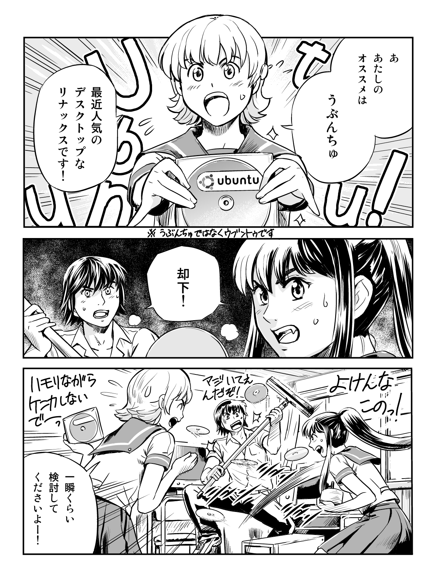

# lenzu

desktop lens (almost like desktop magnifier commonly found in accessibility application for the visually impaired users) which detects images (initially started as OCR) to real-time analyze (via OpenCV) the small window where the mouse cursor hovers (for example, for OCR, it can then add furigana to all the kanji)

## Tesseract versus Windows OCR

Firstly, I want to emphasize that performance means nothing, if accuracies is just crap...  With that said, currently for offline OCR, I've tried
* Tesseract
* [Windows Media.OCR](https://learn.microsoft.com/en-us/uwp/api/windows.media.ocr)
* [Manga-OCR](https://github.com/kha-white/manga-ocr) (Note that his work `mokuro` which integrates manga-ocr is just superior!)

Note that though I've installed EasyOCR, but it turns out it does NOT handle vertical Japanese, hence it's not even part of the considerations.

With that said, I've found that Manga-OCR is the most accurate, but the problem it turns out, is that the folks who publishes the Manga109s dataset are not too responsive and never got back to me, so I have to toss this out of my toolbox as well.

So I'm now left with tesseract and Windows Media.Ocr...  First, the test I've used is the CC licensed manga [Ubunchu!](http://www.aerialline.com/comics/ubunchu/):



Here's the text converted result:

```text
$ time cargo run --bin sample_ocr media/ubunchu01_02.png
    Finished dev [unoptimized + debuginfo] target(s) in 0.55s
     Running `target\debug\sample_ocr.exe media/ubunchu01_02.png`
Windows: Evaluating '"media/ubunchu01_02.png"' for forward-slashes
驫 朝 轗 あ た し の オ ス ス メ は う ぶ ん ち ゅ / 衫 ク 最 近 人 気 の デ ス ク ト ッ プ な リ ナ ッ ク ス で す , 、 ubuntu ※ う ぶ ん ゅ く っ 0 ン 物 ィ 夘 し な い マ 夛 い て ん ー ん 化 秘 ー 一 瞬 く ら い 検 討 し て ′ 、 だ さ い よ ー

real    0m1.856s  <--- ~2 seconds
user    0m0.000s
sys     0m0.000s
```


```text
$ time tesseract.exe media/ubunchu01_02.png stdout -l jpn+jpn_vert+osd --psm 6
=    N    2    。 465
、 いい       必メ - の        い
スッの          7  <        ち
すな \ン。
-   2_/   AN ubuntu
NOか
N       と\        王i       @
※ うぶんあみゅではなくりプッヒゥで3          |
て      \ 一  ーー レブ ーベデーー ー ェー
ミミの
ee
上 っ    ツア王SN 2にンンジSS
だ討瞬    を(タジン| の
シンニーテデい
| にあこ
    レイ人 ーー シク

real    0m33.681s   <- ~34 sec
user    0m0.032s
sys     0m0.000s
```

```text
# time mokuro  --disable_confirmation=True /tmp/mangadir/ ; ls -lAh
Paths to process:
C:\msys64\tmp\mangadir
2024-03-06 16:19:49.269 | INFO     | mokuro.run:run:48 - Processing 1/1: C:\msys64\tmp\mangadir
Processing pages...: 100%|███████████████████ ... ███████████████| 1/1 [00:00<00:00, 10.03it/s]
2024-03-06 16:19:49.433 | INFO     | mokuro.run:run:56 - Processed successfully: 1/1

real    0m32.217s   <--- ~32 sec (but "processing pages" itself only took like 300 mSec!)
user    0m0.000s
sys     0m0.000s
total 296K
```

Note: I had to use mokuro because manga-ocr kept on crashing...  But the "Processing pages" part looks like only took ~300 mSec...  mokuro does extra stuffs like generate html with text position where you can hover over the text to get the text from.  But it's a great app (it was hell compiling it though because the pip version did not work)

Overall, I think manga-ocr is probably the most ideal candidate IF it works, but it's just too finiky and I think I spent more time trying to install it more than code/test it.

As for tesseract, I've tried ALL PSM settings, and PSM==5 was the closest it go to some recognition, hence I really wanted to get a hold of that manga109s data to train tesseract, but they're not responding, so I've given up.

Lastly, the most attractive (ease of library usage, documentations, free/access, accuracies, performance, dependabilities, linking against libs, etc) Microsoft.Media.Ocr is just the most ideal choice!  I cannot stop praising  Microsoft!  But unfortunately, this library restricts to just Windows.

In the end, for now, I've given up on other platforms and concentrating strictly on Windos using Microsoft's Windows.Microsft.Media.Ocr library.

Side note: I don't know how they do it, but the new "Snipping Tool" available on Windows 10/11 has this feature called "Text Action" in which I presume is using the same library, but for some reason, it takes longer time (I think it took like 7 seconds) and here's the result:

```text
リナックスです!
/1モリなか”ら
デスクトップな
最近人気の
オススメは
BU!
※うぶんちゅではなくウイントカです
あ
うぶんちゆ
あたしの
ubuntu
却下!
Tっわしない
マミ112元
んだぞ!(
よけんなー
このっl
くださいよー!
検討して
一瞬くらい
```

Unfortunately, the tool has no interface/options to instruct that it should OCR from top-to-bottom+right-to-left so the order of the text becomes left-to-right (backwards) even though it figures out it is vertical text (top-to-bottom).  In any case, it's not a OCR application, but has the capabilities and I'm sure it's using the same library.

### windows-rs

For windows.Media.Ocr integrations with rust, you'll need to at least enable 2 features `Media_Ocr` and `Globalization`.  You can click on the [Feature Search](https://microsoft.github.io/windows-rs/features/) link in the [crates.io](https://crates.io/crates/windows) page to search for what other features you'd need:

```dotnetcli
#$ cargo add windows-rs --features Media_Ocr,Globalization,Storage_Streams
```
