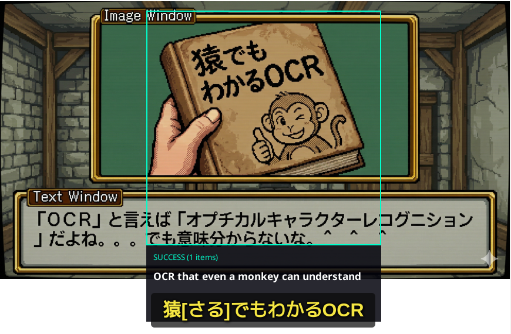
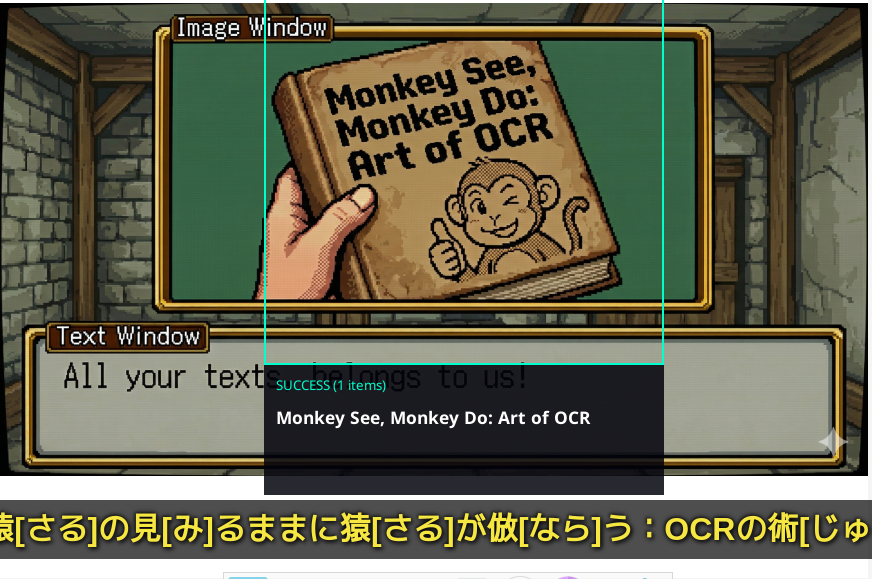

# lenzu 「レンズ」 (LINUX ONLY)

**Linux only** (X11, GTK3). No Windows or macOS support.

Desktop OCR lens — a transparent floating window that follows the mouse cursor, captures the region under it on demand, and sends it to a local or remote LLM for OCR and translation. Results appear in a separate transparent overlay HUD (`lenzu_server`).

The key dif:ference from browser extensions like Yomitan/Rikaichan: this operates on **images** (GPU-rendered video, game windows, PDFs, anything on screen), not UTF-8 text.






> **Architecture note**: The Windows/winit/GTK4 experiments are archived in `prototypes/`. The active implementation uses **GTK3** (`gtk-rs` 0.18) on Linux/X11. GTK4 was evaluated and abandoned due to integration complexity — GTK3 provides everything needed and is simpler to build against. See [Technical Design](./docs/technical-design.md) for current architecture.

## Architecture (Current)

```
lenzu (GTK3 client)               lenzu_server (Electron)
  floating lens window     UDP     transparent overlay HUD
  X11 root capture       ──────►  renders translated text
  multi-tier OCR backend           ArrowUp/Down moves position
  manages server lifecycle
```

1. **Capture**: `x11rb` captures the X11 root window directly — bypasses GPU-accelerated and hardware-rendered windows correctly.
2. **OCR/Translation**: Multi-tier fallback chain, tried in order with per-tier timeouts:
   - **Local primary** (e.g. `gemma4:e2b` via ollama, 3 s) — fully on-device, no API key needed
   - **Local fallbacks** (e.g. `glm-ocr`, `qwen2.5vl`, 3 s each) — smaller OCR-specialist models
   - **Remote fallback** (OpenRouter/Gemini 2.0 Flash, 15 s) — cloud fallback when local fails

   All backends use the same production code path (single source of truth in `client.rs`).  
   Streaming (`"stream": true`) keeps each request's TCP connection alive, preventing ollama's  
   server-side write timeout from firing during slow CPU/partial-GPU inference.

3. **Overlay**: Formatted text sent via UDP loopback to `lenzu_server`, an Electron transparent window pinned to screen edge.

### Privacy modes

| Mode                           | Config                     | API key needed?           | Images leave device? |
| ------------------------------ | -------------------------- | ------------------------- | -------------------- |
| Fully local                    | `OPENROUTER_API_KEY` unset | No                        | No                   |
| Local-first                    | default                    | No (local) / Yes (remote) | Only on fallback     |
| Remote-only (Ctrl+Shift+Click) | any                        | Yes                       | Yes                  |

### Inference speed on typical hardware

| Backend                       | VRAM            | Typical latency |
| ----------------------------- | --------------- | --------------- |
| gemma4:e2b — full GPU (8 GB+) | ~7.4 GB         | ~15–30 s        |
| gemma4:e2b — partial GPU      | ~2 GB GPU + CPU | 60–120 s        |
| glm-ocr — full GPU (4 GB)     | ~2.2 GB         | ~5–15 s         |
| Gemini 2.0 Flash (remote)     | —               | ~3–5 s          |

For 4 GB VRAM cards, set `gemma4:e2b` as local fallback and `glm-ocr` as primary, or skip gemma and use the glm-ocr → remote chain.

## Hardware and Privacy

- **Local-first by default**: `ollama` runs on the same machine; no data leaves the device unless the local models fail and you have `OPENROUTER_API_KEY` set.
- **Cloud OCR**: Automatically falls back to OpenRouter (Gemini 2.0 Flash) when local inference times out. Disable by leaving `OPENROUTER_API_KEY` unset.
- **GPU Acceleration**: Optional YOLOv8n pre-detection (model in repo) to crop text regions before API call, reducing token cost ~80%.

## Libraries & Dependencies

- [`gtk` 0.18](https://crates.io/crates/gtk) — GTK3 bindings (gtk-rs). **GTK3, not GTK4.**
- [`x11rb`](https://crates.io/crates/x11rb) — X11 protocol (screen capture)
- [`cairo-rs`](https://crates.io/crates/cairo-rs) — 2D drawing
- [`pango`](https://crates.io/crates/pango) / [`pangocairo`](https://crates.io/crates/pangocairo) — text layout and CJK rendering
- [`reqwest`](https://crates.io/crates/reqwest) — HTTP client (OpenRouter API)
- [`isolang`](https://crates.io/crates/isolang) — ISO 639-3 language codes
- Electron (`lenzu_server`) — transparent overlay window

## Build & Run

```bash
# 1. Install system dependencies
./scripts/setup.sh

# 2. Set API key
export OPENROUTER_API_KEY=sk-your-key-here

# 3. Build and run (builds lenzu_server on first run)
./scripts/run.sh
```


See [`lenzu/README.md`](lenzu/README.md) for full configuration reference and controls.

## TODO

- 2-pass pipeline: pass 1 detects text bounding boxes (YOLO or GLM-OCR), pass 2 sends one crop per box — reduces token cost ~80% and improves accuracy on multi-block images
- Wayland support via xdg-desktop-portal
- Multi-monitor capture at non-zero offsets
