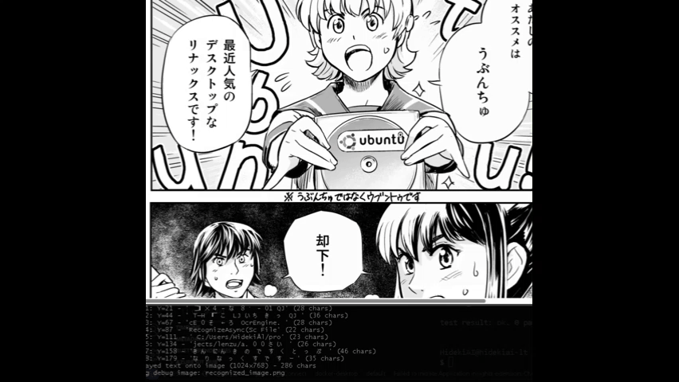
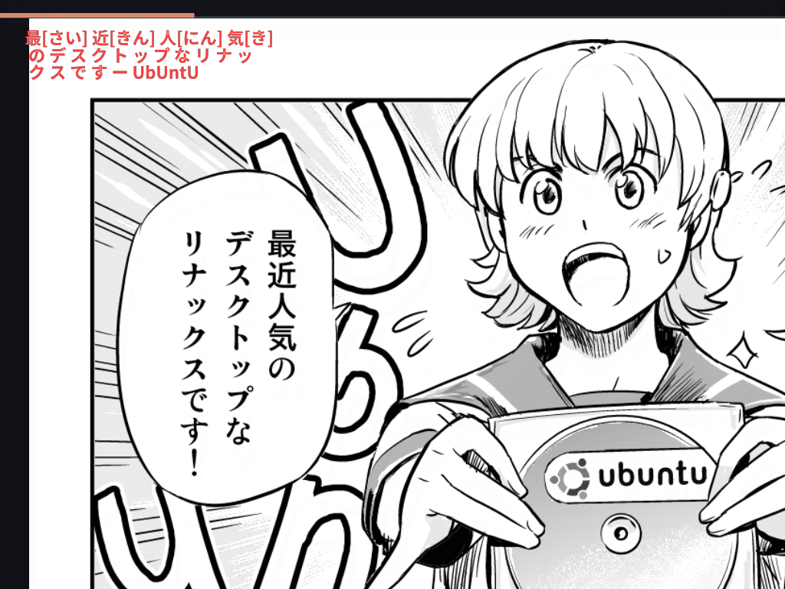

# lenzu

Desktop lens (almost like desktop magnifier commonly found in accessibility application for the visually impaired users) which detects images via OFFLINE OCR to real-time analyze (possibly via OpenCV or neural network text detectors in the future) the small window where the mouse cursor hovers to convert kanji to hiragana (will not furigana) dynamically similar to Yomitan/Rikaichan/Rikaikun (and other browser extension for plain-TEXT).

Again, the key differences is that it is an OCR (optical character recognition) from images, NOT plain (UTF8) TEXT. For UTF8 based texts, use the aforementioned (reliable and proven to work) tool such as [Yomitan](https://github.com/themoeway/yomitan).

> **Note**: The legacy Windows-first implementation (built around `windows-rs` and `winit`) is being deprecated in favor of a new cross-platform (Linux-primary) architecture based on GTK4 and X11/Wayland. For full technical details on the V2 architecture, please see the [Technical Design Document](./docs/technical-design.md). (The original OCR research and engine evaluations found in [TDD OCR](./docs/technical-design.OCR.md) are now out-of-date and deprecated).

## Features & UI Design

### Lens Interaction Mode

- **Manual Region Selection**: Users move a transparent lens window over text regions. On click, it captures only the lens area (+5px padding), reducing the processing area by ~95% compared to full-screen capture.
- **Hotkeys**:
  - **Right-click**: Standard furigana/romaji conversion.
  - **Shift+Right-click**: Direct translation to configured language (default: English).
  - **Ctrl+Right-Click**: Freeze current OCR result.
  - **Mouse Wheel** (or PgUp|PgDn): Adjust lens magnification (1x-4x).
  - **Tab**: Scan entire desktop for Japanese text and save discovered text-rectangles to local buffer (`/dev/shm/`).

## Architecture (V2)

Lenzu is moving towards a modern, multi-layered approach to Japanese text extraction, separating text *detection* from text *recognition*.

1. **Capture Layer**:
   - Built on `x11rb`, `gdk4-x11`/`gdk4-wayland`, and `cairo-rs`.
   - **Phase I**: Fullscreen capture via GTK4 Window.
   - **Phase II**: Smart region capture with compositor integration for minimal latency.
2. **Processing Layer (Detection -> Recognition)**:
   - **Text Detection**: Lightweight models (EAST, CRAFT, DBNet, or YOLOv8-tiny) detect text regions (speech bubbles, curved text).
   - **Text Recognition**: Extracted regions are passed to an OCR engine (Tesseract, Windows Media OCR, or Cloud APIs).
   - **Benefit**: Reduces the OCR processing area by 80-90%, lowering token costs for cloud services and improving offline performance.
3. **Output Layer**:
   - Text rendering with furigana via Kakasi.
   - History tracking and Clipboard integration.
   - Translation pipeline (OCR → Kakasi → Dictionary lookup → Translation API).

## Hardware and Privacy

- **Offline-First**: Rationale for prioritizing offline functionality is for performance and privacy. Images are never transmitted off-device unless the user explicitly opts for premium/cloud services.
- **CPU-First Design**: The full pipeline (detection + OCR) works entirely on the CPU, ensuring compatibility with any hardware.
- **GPU Acceleration**: Optional integration of YOLOv8-tiny models (via ONNX Runtime) for detection acceleration on systems with compatible GPUs.

## Libraries & Dependencies

- **Rust Implementation**:
  - [`x11rb`](https://crates.io/crates/x11rb) - Modern X11 protocol implementation.
  - [`gdk4-x11`](https://crates.io/crates/gdk4-x11) / [`gdk4-wayland`](https://crates.io/crates/gdk4-wayland) - Multi-monitor handling.
  - [`cairo-rs`](https://crates.io/crates/cairo-rs) - Surface rendering.
- **OCR & NLP**:
  - **kakasi**: Japanese text conversion from kanji to hiragana.
  - **tesseract** / **leptonica**: Open-source OCR engine (requires `jpn_vert.traineddata`).
  - **windows-rs**: For legacy Windows Media OCR integration.

## Build/Compile Notes

- **Linux (Debian/Ubuntu)**: 
  - Install dependencies: `apt install kakasi tesseract-ocr leptonica`
  - Build via Cargo.
- **Windows (MinGW64)**: 
  - Use `mingw64` toolchain. Install packages via `pacman`. 
  - Enable `Media_Ocr` feature in Cargo if compiling the legacy OCR module.
- **Debugging**: Conditional compilation writes `recognized_image.png` for offline inspection; use debug builds for testing.

## Sample outputs and results

*Note: The detailed performance benchmarks and legacy visual comparisons in the deprecated [TDD OCR](./docs/technical-design.OCR.md) are out-of-date.*

Please note that the UIX is currently being revamped using GTK4.

## TODO

- Transition completely from `winit` to GTK4/gdk4 for window management.
- Implement EAST/CRAFT or YOLOv8-tiny for the text detection phase.
- Train manga-109s dataset for Tesseract to improve Linux OCR accuracy.
- Add online OCR fallback option via OAuth2 (Google Cloud Vision).
- Develop image preprocessing pipeline (grayscale, denoise, contrast adjustment).
- Integrate dictionary lookup for enhanced translation capabilities.
- Replace the fake kakasi crate with the official version.
