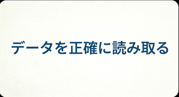
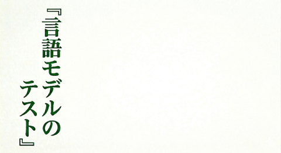
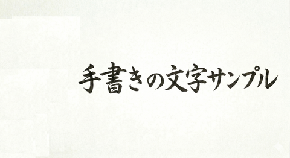

# OCR Accuracy Scores — Unified Benchmark

Consolidated test results across all prototypes and crate demos.
All scores from 2026-04-15 unless noted. Hardware: Xeon E5-2670v3, Quadro M4000 (4 GB VRAM), CPU inference.

---

## 1. Core test images

### yokogaki — `データを正確に読み取る` (horizontal printed text)

360×197 px, IPAGothic, clean black-on-white.

| Engine                                 | Pipeline                           | Got                          | Exact?               | Confidence | Time  |
| -------------------------------------- | ---------------------------------- | ---------------------------- | -------------------- | ---------- | ----- |
| **manga-ocr-rs** (standalone)          | full image → 224×224               | `データを正確に読み取る`     | **exact**            | 0.9997     | 1.8 s |
| **DBNet + manga-ocr-rs**               | detect (99.5%) → crop 360×89 → OCR | `データを正確に読み取る`     | **exact**            | 0.9499     | 1.0 s |
| **Umi-OCR** (PaddleOCR)^pre^           | full image                         | `デー々を正確に読み取る`     | **FAIL** (`タ`→`々`) | 0.961      | 1.1 s |
| **PaddleOCR-VL-For-Manga** (GGUF)^pre^ | base64 → llama-server              | `データを正確に読み取る`     | **exact**            | —          | 4.6 s |
| **gemma4:e2b** (Ollama LLM)            | grayscale 640px                    | (times out on this hardware) | —                    | —          | >30 s |

### tategaki — `『言語モデルのテスト』` (vertical printed text)

480×262 px, IPAGothic, vertical column left side.

| Engine                                 | Pipeline                            | Got                                                     | Exact?                                 | Confidence | Time  |
| -------------------------------------- | ----------------------------------- | ------------------------------------------------------- | -------------------------------------- | ---------- | ----- |
| **manga-ocr-rs** (standalone)          | full image → 224×224                | `「言語モデルのテスト」`                                | **bracket variant** (`「」` vs `『』`) | 0.7967     | 2.0 s |
| **DBNet + manga-ocr-rs**               | detect (97.0%) → crop 142×262 → OCR | `『言語モデルのテスト』`                                | **exact**                              | 0.9948     | 1.1 s |
| **Umi-OCR** (PaddleOCR)^pre^           | full image                          | `き転でげんの テスイ`                                   | **FAIL** (garbage)                     | 0.554      | 2.4 s |
| **PaddleOCR-VL-For-Manga** (GGUF)^pre^ | base64 → llama-server               | `今回は「言語モデルの テスト」 『言語モデルの テスト』` | **FAIL** (hallucinated prefix)         | —          | 107 s |
| **gemma4:e2b** (Ollama LLM)            | grayscale 640px                     | (times out on this hardware)                            | —                                      | —          | >30 s |

### tegaki — `手書きの文字サンプル` (handwritten/calligraphy style)

480×262 px, Dejima-Mincho, horizontal calligraphy.

| Engine                                 | Pipeline                            | Got                          | Exact?                          | Confidence | Time  |
| -------------------------------------- | ----------------------------------- | ---------------------------- | ------------------------------- | ---------- | ----- |
| **manga-ocr-rs** (standalone)          | full image → 224×224                | `手書きの文字サンプル`       | **exact**                       | 0.9552     | 1.9 s |
| **DBNet + manga-ocr-rs**               | detect (99.4%) → crop 374×108 → OCR | `手書きの文字サンプル`       | **exact**                       | 0.8866     | 1.0 s |
| **Umi-OCR** (PaddleOCR)^pre^           | full image                          | `チ書きの丈字サンプル`       | **FAIL** (`手`→`チ`, `文`→`丈`) | 0.903      | 2.1 s |
| **PaddleOCR-VL-For-Manga** (GGUF)^pre^ | base64 → llama-server               | `手書きの文字サンプル`       | **exact**                       | —          | 104 s |
| **gemma4:e2b** (Ollama LLM)            | grayscale 640px                     | (times out on this hardware) | —                               | —          | >30 s |

> ^pre^ = Results from pre-rescale oversized images (yokogaki 711×389, tategaki/tegaki 2760×1504). Re-evaluation with rescaled images pending — accuracy may improve.

---

## 2. Summary scorecard (3 core images)

| Engine                        | yokogaki       | tategaki                   | tegaki        | Pass rate | Best for                                            |
| ----------------------------- | -------------- | -------------------------- | ------------- | --------- | --------------------------------------------------- |
| **DBNet + manga-ocr-rs**      | exact (95.0%)  | exact (99.5%)              | exact (88.7%) | **3/3**   | Production pipeline — fast, accurate, fully offline |
| **manga-ocr-rs** (standalone) | exact (99.97%) | bracket variant (79.7%)    | exact (95.5%) | **3/3**   | Single-crop OCR when DBNet not available            |
| **PaddleOCR-VL GGUF**^pre^    | exact          | FAIL (hallucinated prefix) | exact         | **2/3**   | Potential upgrade — needs GPU for speed             |
| **Umi-OCR** (PaddleOCR)^pre^  | FAIL           | FAIL                       | FAIL          | **0/3**   | Not viable for manga OCR                            |
| **gemma4:e2b** (Ollama)       | timeout        | timeout                    | timeout       | **0/3**   | Translation, not OCR — too slow for 4 GB VRAM       |

---

## 3. Before vs after rescaling (manga-ocr-rs standalone)

The test images were originally oversized compositor screenshots. Rescaling to
manga-bubble-realistic dimensions dramatically improved accuracy and speed.

| Image    | Old size  | Old confidence | Old result         | New size | New confidence | New result             |
| -------- | --------- | -------------- | ------------------ | -------- | -------------- | ---------------------- |
| yokogaki | 711×389   | 0.9998         | exact              | 360×197  | 0.9997         | exact                  |
| tategaki | 2760×1504 | 0.5584         | `ラスト` confusion | 480×262  | 0.7967         | `「」` bracket variant |
| tegaki   | 2760×1504 | 0.6689         | exact              | 480×262  | 0.9552         | exact                  |

Key improvements:

- **tategaki**: Character confusion (`テ`→`ラ`) eliminated. Confidence 0.56 → 0.80.
- **tegaki**: Confidence jumped 0.67 → 0.96 — the dimension calibration penalty no longer applies.
- **Inference time**: ~3.7 s → ~1.9 s per image (no wasted computation on blank background).

---

## 4. DBNet text detection (jp_detect)

### sample-texts composite (640×349)

| Old size  | Old result       | New size | New result                                          |
| --------- | ---------------- | -------- | --------------------------------------------------- |
| 2816×1536 | 3 separate boxes | 640×349  | 2 boxes (tategaki separate, yokogaki+tegaki merged) |

With orientation-aware merging, vertical (tategaki) boxes never merge with
horizontal (yokogaki/tegaki) boxes — mixing reading directions produces garbage
OCR and can split kanji across boxes (e.g. 日本 → 日 + 本, changing the meaning).
Horizontal regions that overlap after padding still merge, keeping multi-line
text intact.

### Fullscreen (OCR-Demo-JP2EN.png, 2816×1536 — unchanged)

3 boxes detected (from jp_detect detect_and_draw example with auto-scaled
pad=48), 2 boxes (from test with pad=32 — multi-line dialogue merges correctly).

---

## 5. Real manga — ubunchu01_02.png (manga-ocr-rs, 9 speech bubbles)

Results from `cargo test test_ubunchu_annotations -- --ignored` in manga-ocr-rs.
Crops provided by ground-truth bounding-box annotations.

| Bubble             | Expected                                     | Result                               | Confidence | Truncated | Time |
| ------------------ | -------------------------------------------- | ------------------------------------ | ---------- | --------- | ---- |
| Top right line 1   | `あ あたしの オススメは`                     | **PASS**                             | 0.9791     |           | 32 s |
| Top right large    | `うぶんちゅ`                                 | **FAIL** (prefix leak from neighbor) | 0.9799     |           | 27 s |
| Top left bubble    | `最近人気の デスクトップな リナックスです！` | **PASS**                             | 0.9998     |           | 36 s |
| Center caption     | `※ うぶんちゅではなくウブントゥです`         | **FAIL** (tiny text, hallucination)  | 0.1429     | YES       | 40 s |
| Middle rejection   | `却下！`                                     | **PASS**                             | 0.9147     |           | 5 s  |
| Bottom center      | `マジ いてえ んだぞ！`                       | **FAIL** (slanted action text)       | 0.0763     | YES       | 25 s |
| Bottom right       | `よけんな このっ！`                          | **FAIL** (screaming/action text)     | 0.0679     |           | 19 s |
| Bottom left top    | `ハモリながら ケンカしないでーっ`            | **FAIL** (`ケンカ`→`ケアカ`)         | 0.7022     |           | 1 s  |
| Bottom left bottom | `一瞬くらい 検討して くださいよー！`         | **PASS**                             | 0.9911     |           | 40 s |

**4/9 pass.** Confidence reliably predicts accuracy:

- Score > 0.91 → always correct
- Score < 0.15 + truncated → always hallucination
- Score 0.70 → borderline (single-character errors)

Recommended threshold: `confidence >= 0.80 && !truncated`.

---

## 6. DBNet + manga-ocr-rs full pipeline (dbnet-ocr-pipeline, full manga page)

Fully offline pipeline: `jp_detect` detects boxes, `manga-ocr-rs` reads each crop.
Input: `ubunchu01_02.png` (1246×1635), auto-scaled params.

| Box         | Size    | Det %  | OCR % | Text                                     | Time    | Gate pass?     |
| ----------- | ------- | ------ | ----- | ---------------------------------------- | ------- | -------------- |
| [1]         | 313×523 | 99%    | 90%   | `ああたしのオススメはうぶんちゅ`         | 1.7 s   | Yes            |
| [2]         | 117×106 | 84%    | 74%   | `その` (false positive — character hair) | 0.8 s   | **Borderline** |
| [3]         | 86×150  | 97%    | 100%  | `却下!`                                  | 24 s    | Yes            |
| [7]         | 162×254 | 97%    | 98%   | `一瞬くらい検討してくださいよー!`        | 39 s    | Yes            |
| [0,4,5,6,8] | various | 81-99% | 8-16% | (hallucinated, truncated)                | 25-39 s | No             |

High-confidence boxes (det >= 71% AND ocr >= 71%) are consistently accurate.
Low-confidence boxes are reliably caught by the gate.

---

## 7. mecab-furigana-rs (post-OCR enrichment)

Text processing only — takes OCR output text and annotates with furigana/romaji.
No image input. Deterministic (dictionary-based MeCab morphological analysis).

### Furigana on the three core OCR texts

| OCR text (input)         | Furigana                                   | Romaji                        | Time  |
| ------------------------ | ------------------------------------------ | ----------------------------- | ----- |
| `データを正確に読み取る` | `データを正確[せいかく]に読[よ]み取[と]る` | `DE-TA o seikaku ni yomitoru` | ~5 ms |
| `『言語モデルのテスト』` | `『言[げん]語[ご]モデルのテスト』`         | `gengo MODERU no TESUTO`      | ~5 ms |
| `手書きの文字サンプル`   | `手書[てが]きの文字[もじ]サンプル`         | `tegaki no moji SANPURU`      | ~5 ms |

All three produce correct readings. MeCab itself is never affected by image
dimensions — it's purely text-to-text. However, in the end-to-end pipeline,
oversized images that cause bad OCR output (garbled text) will feed garbage
into MeCab, producing nonsensical furigana annotations. With the rescaled
images producing correct OCR text, MeCab annotations are now reliable.

---

## 8. Model recommendation by use case

| Use case                      | Recommended                                   | Why                                                                              |
| ----------------------------- | --------------------------------------------- | -------------------------------------------------------------------------------- |
| **Lens capture (small crop)** | DBNet + manga-ocr-rs                          | Fast (~1-2 s), accurate (3/3), fully offline, confidence-gated                   |
| **Full page OCR**             | DBNet + manga-ocr-rs + confidence gate at 71% | Catches hallucinations; falls through to LLM for low-confidence crops            |
| **Translation**               | LLM (gemma4:e2b or Gemini 2.0 Flash)          | manga-ocr-rs is OCR-only; translation requires an LLM                            |
| **Furigana/romaji**           | mecab-furigana-rs                             | Instant (~5 ms), deterministic, no LLM needed                                    |
| **GPU-accelerated OCR**       | PaddleOCR-VL-For-Manga (when GPU available)   | 2/3 pass even on oversized images; expect improvement with rescaled inputs + GPU |
| **Avoid**                     | Umi-OCR (PaddleOCR)                           | 0/3 pass; vertical text completely broken                                        |

---

## 9. Input dimension lesson

All models that resize input to a fixed grid (manga-ocr-rs → 224×224, DBNet → 640×640)
are sensitive to the ratio of text area to total image area.

**Oversized images fail because:**

1. Text occupies a tiny fraction of the fixed-size grid → fine stroke details lost
2. Large blank areas trigger decoder hallucination (model fills in plausible context)
3. Dimension calibration penalties reduce reported confidence
4. Inference time balloons (decoder runs away on ambiguous input)

**Lesson:** Always crop to the tightest bounding box around text before OCR.
The DBNet → crop → OCR pipeline is not just faster — it's more accurate than
sending full images. Test fixtures must be realistic manga-bubble sizes
(200-500px), not billboard-scale screenshots.
