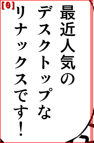
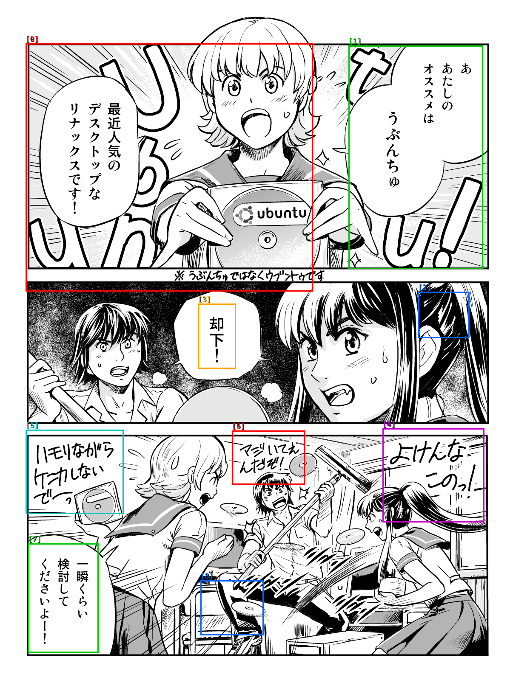
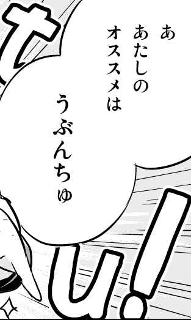
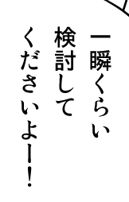

# dbnet-ocr-pipeline

Fully offline Japanese OCR pipeline combining two crates:

1. **[`jp_detect`](https://crates.io/crates/jp_detect)** (DBNet) — locates text bounding boxes in an image
2. **[`manga-ocr-rs`](https://crates.io/crates/manga-ocr-rs)** — recognizes Japanese text from each cropped region

No LLM, no cloud API. Raw Japanese text output.

## Usage

```bash
cargo run -p dbnet-ocr-pipeline -- <image> [options]

# Options:
#   --json                output results as JSON array
#   --threshold <0.0-1.0> DBNet confidence threshold (auto-scaled by image size)
#   --dilation <pixels>   DBNet dilation radius (auto-scaled by image size)
#   --pad <pixels>        crop padding in each direction (auto-scaled by image size)
#   --save-boxes <path>   save image with bounding box overlay
#   --save-crops <dir>    save individual crop images to directory
```

## Results

### Single panel crop (187x286)

Auto-scaled params: threshold=0.2, dilation=16, pad=32 (longest edge 286 — small crop bucket)



The entire panel is detected as one box. OCR result: `最近人気のデスクトップなリナックスです!` — **perfect**.

For small crops (lens-sized captures), high dilation merges nearby character blobs into
a single region, which is exactly what we want — one box per speech bubble.

### Full manga page (1246x1635)

Auto-scaled params: threshold=0.35, dilation=6, pad=16 (longest edge 1635 — medium bucket)



9 boxes detected. Results by box:

| Box | Size | OCR text | Accurate? |
|-----|------|----------|-----------|
| [0] red | 672x581 | `いや、いや...いやいやぁっ、こういう最近人気の...` (hallucinated) | No — merged multiple panels |
| [1] green | 313x523 | `ああたしのオススメはうぶんちゅ` | Yes |
| [2] blue | 117x106 | `その` | Partial |
| [3] orange | 86x150 | `却下!` | Yes |
| [4] magenta | 236x218 | `よけんなこのっ!!!...` (hallucinated) | No — mixed art/text |
| [5] cyan | 227x195 | `いモリなからケーカしないで~~~っ!!!...` (hallucinated) | No — too much content |
| [6] red | 168x124 | `マジいてんんだぞ!!!...` (hallucinated) | No |
| [7] green | 162x254 | `一瞬くらい検討してくださいよー!` | Yes |
| [8] blue | 145x126 | (hallucinated) | No |

Individual crops (generated via `--save-crops`):

| crop_01 (box [1]) | crop_03 (box [3]) | crop_07 (box [7]) |
|:-:|:-:|:-:|
|  |  |  |
| `ああたしのオススメはうぶんちゅ` | `却下!` | `一瞬くらい検討してくださいよー!` |

## Discoveries

### Auto-scaling detection parameters by image size

DBNet always runs at 640x640 internally. A dilation of N pixels at 640-res represents
`N * (original / 640)` pixels in the original image — much more blur for large inputs.
Parameters must scale inversely with image size.

The pipeline uses the same lookup table as the main lenzu app:

| Longest edge | Dilation | Threshold | Pad | Use case |
|-------------|----------|-----------|-----|----------|
| <= 800      | 16       | 0.20      | 32  | Small lens crops — merge nearby character blobs |
| <= 1280     | 10       | 0.25      | 24  | Medium screenshots |
| <= 1920     | 6        | 0.35      | 16  | Full HD captures, manga pages |
| <= 2560     | 3        | 0.45      | 12  | 2K/QHD |
| > 2560      | 0        | 0.50      | 8   | 4K — almost no dilation needed |

CLI flags `--threshold`, `--dilation`, `--pad` override the auto-scaled values.

### Small crops: high dilation works perfectly

For small images (lens-sized captures, single panels), dilation=16 merges all character
blobs in a speech bubble into one box. manga-ocr-rs handles the full bubble as a single
input and produces accurate results. The 187x286 panel crop was recognized perfectly as
one box.

### Large images: merged boxes cause hallucination

For full manga pages, even dilation=6 can merge neighboring speech bubbles or capture
art alongside text. When a crop contains too much content (multiple text columns, mixed
art and text), `manga-ocr-rs` generates endless filler Japanese text — hundreds of characters
of grammatically plausible but meaningless output.

This is a known limitation of the ViT+BERT architecture: the beam search decoder has no
length constraint and will fill the output when the input is ambiguous.

**Key insight**: the OCR model works well when each crop contains a single, tight text region.
The quality bottleneck is detection precision, not OCR accuracy.

### Crop size correlates with accuracy

From the full-page run:
- **Accurate boxes**: [1] 313x523, [3] 86x150, [7] 162x254 — these captured clean, isolated speech bubbles
- **Hallucinated boxes**: [0] 672x581, [4] 236x218, [5] 227x195 — these captured merged regions or mixed art

The pattern: boxes that span a single speech bubble produce accurate OCR regardless of size.
Boxes that merge multiple bubbles or include background art trigger hallucination. Size alone
isn't the problem — it's whether the crop contains exactly one text region.

### Performance (CPU, no GPU acceleration)

| Stage | Time |
|-------|------|
| DBNet detection | ~800-1800 ms |
| manga-ocr model load | ~1100-1300 ms |
| OCR per crop | ~1-42 s (varies with content) |
| Full page (9 crops) | ~240 s total |
| Single panel (1 crop) | ~44 s total |

OCR is the bottleneck — beam search decoding is CPU-intensive. Detection is fast (~1-2s).
For production use, ONNX GPU execution providers (CUDA, TensorRT) would reduce per-crop
latency dramatically.

### Next steps for lenzu integration

1. **Panel segmentation before detection** — split manga pages into individual panels first,
   then run DBNet on each panel for tighter bounding boxes
2. **Max crop size filter** — reject crops above a threshold (e.g. 300px in any dimension)
   to avoid hallucination on merged boxes
3. **GPU acceleration** — enable ONNX CUDA EP for both jp_detect and manga-ocr-rs
4. **Parallel OCR** — process crops concurrently (models are thread-safe)
