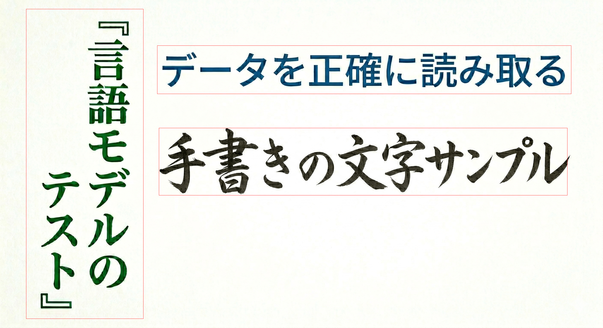
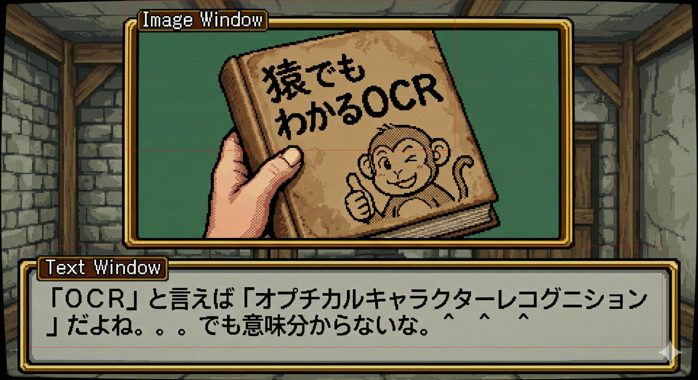

# dbnet-test — DBNet text detection prototype

This was the original standalone prototype used to validate DBNet ONNX inference
before the logic was extracted into the
**[jp_detect](https://github.com/CodeMonkeyNinja/jp_detect)** crate.

The implementation details (preprocessing, postprocessing, parameter rationale,
union-merge algorithm, etc.) are now documented and maintained there.

## Quick test

```bash
cargo run -p dbnet-test -- --test
```

Output PNGs are written to `/dev/shm/lenzu/`.

## Sample output





---

# Credits & Citations

## Text Detection Model

Real-time bounding box detection uses the DBNet Multi-Language model.

Model: [text_detection_dbnet_ml_v0.2](https://huggingface.co/StabRise/text_detection_dbnet_ml_v0.2) — optimized by StabRise

## Original DBNet Research

```
@inproceedings{liao2020real,
  title={Real-time Scene Text Detection with Differentiable Binarization},
  author={Liao, Minghui and Wan, Zhaoyi and Yao, Cong and Chen, Kai and Bai, Xiang},
  booktitle={Proceedings of the AAAI Conference on Artificial Intelligence},
  year={2020}
}
```
